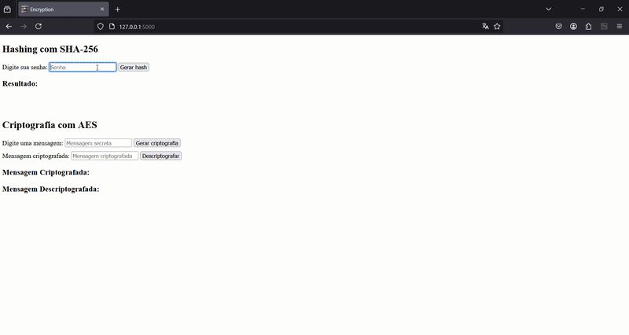

# Interpretando Scripts de Segurança da Informação

**Vitor Antunes Ferreira - 11221100958**

---

Nesta aula foi proposto o seguinte exercício:  
    Reimplementar criptografia simétrica e hashing na linguagem de sua preferência, sem ser Javascript.

A línguagem escolhida foi `python` utilizando as seguintes ferramentas:

- [Flask](https://flask.palletsprojects.com/en/stable/)
- [pycryptodome](https://pypi.org/project/pycryptodome/)

Para executar o projeto, é necessário seguir os seguintes passos:

1. Instalar bibliotecas necessárias:
```powershell
pip install -r requirements.txt
```

2. Iniciar o servidor Flask:
```powershell
python app.py
```

3. Abra à página web na porta correta
```powershell
PS C:\Users\flamingo\Desktop\AfterLifeDeath\Fabiano-Pol> python app.py
 * Serving Flask app 'app'
 * Debug mode: off
WARNING: This is a development server. Do not use it in a production deployment. Use a production WSGI server instead.
 * Running on http://127.0.0.1:5000
Press CTRL+C to quit
```

Agora basta utilizar a aplicação...


---

## Como fuciona

1. Hashing com SHA-256

O primeiro formulário permite ao usuário gerar um hash da sua senha utilizando o algoritmo SHA-256.

Como Funciona:
- O usuário insere uma senha no campo de entrada.
- A senha é enviada para o servidor, onde é processada e convertida para um hash com o SHA-256.
- O hash gerado é exibido na tela.

```python
@app.route('/generate_hash', methods=['POST'])
def generate_hash():
    """Processa a geração de hash SHA-256"""
    password = request.form.get('hash_input')  # Pega a senha do formulário
    hashed = sha256(password.encode()).hexdigest()  # Gera um hash SHA-256 da senha
    return render_template('index.html', result_hash=hashed)  # Renderiza a página com o hash gerado

```

Explicação do Código:

1. `request.form.get('hash_input')`: Obtém o valor da senha fornecida pelo usuário no formulário.

2. `sha256(password.encode()).hexdigest()`: Converte a senha para bytes e gera o hash SHA-256 correspondente.

3. `render_template('index.html', result_hash=hashed)`: Renderiza a página inicial, exibindo o hash gerado.

---

2. Criptografia com AES

O segundo formulário permite ao usuário criptografar uma mensagem usando o algoritmo AES (Advanced Encryption Standard) em modo CBC. Há também um formulário para descriptografar mensagens previamente criptografadas.

Como Funciona:
- O usuário insere uma mensagem no campo de entrada.
- A mensagem é criptografada utilizando AES e exibida como texto criptografado em Base64.
- O usuário pode inserir uma mensagem criptografada para obter a versão descriptografada.

```python
@app.route('/encrypt', methods=['POST'])
def encrypt():
    """Realiza a criptografia AES da mensagem"""
    message = request.form.get('aes_input')  # Pega a mensagem do formulário
    key, iv = get_aes_key()  # Gera ou recupera chave e IV para AES
    
    # Configura cipher AES em modo CBC com chave e IV
    cipher = AES.new(key, AES.MODE_CBC, iv)
    
    # Criptografa mensagem com padding e codifica em Base64
    ct_bytes = cipher.encrypt(pad(message.encode(), AES.block_size))
    encrypted = b64encode(ct_bytes).decode('utf-8')
    
    return render_template('index.html', encrypted_msg=encrypted)  # Retorna texto cifrado
```

Explicação do Código de Criptografia:

1. `get_aes_key()`: Recupera ou gera uma chave secreta e um vetor de inicialização (IV) para AES.

2. `AES.new(key, AES.MODE_CBC, iv)`: Cria um objeto de criptografia AES no modo CBC utilizando a chave e IV fornecidos.

3. `pad(message.encode(), AES.block_size)`: Adiciona padding à mensagem para que seu tamanho seja múltiplo do tamanho do bloco do AES.

4. `b64encode(ct_bytes).decode('utf-8')`: Codifica a mensagem criptografada em Base64 para facilitar a visualização.

Código de Descriptografia:

```python
@app.route('/decrypt', methods=['POST'])
def decrypt():
    """Realiza a descriptografia AES da mensagem"""
    encrypted_msg = request.form.get('aes_input')  # Pega a mensagem cifrada do formulário
    key, iv = get_aes_key()  # Gera ou recupera chave e IV para AES
    
    try:
        # Configura cipher AES em modo CBC
        cipher = AES.new(key, AES.MODE_CBC, iv)
        
        # Descriptografa e remove padding da mensagem
        pt = unpad(cipher.decrypt(b64decode(encrypted_msg)), AES.block_size)
        decrypted = pt.decode('utf-8')  # Converte bytes para string
    except (ValueError, KeyError):
        decrypted = "Erro ao descriptografar a mensagem."
    
    return render_template('index.html', decrypted_msg=decrypted)  # Retorna resultado
```

Explicação do Código de Descriptografia:

1. `b64decode(encrypted_msg)`: Decodifica a mensagem criptografada em Base64 para bytes.

2. `unpad(cipher.decrypt(...), AES.block_size)`: Descriptografa a mensagem e remove o padding adicionado durante a criptografia. 

3. `pt.decode('utf-8')`: Converte o texto descriptografado de bytes para string.


